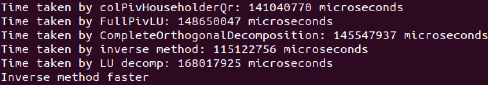

# Test result from eigen3EquationSolver

**Equation solvers that where tested:**  
- colPivHouseholderQr
- fullPivLu
- completeOrthogonalDecomposition
- inverse method (A_inv*b)
- LU decomposition (2 steps)

**Test environement:**  
- Testing for nonlinear transient simulation
- Mainly dealing with relatively small matrices => *Test used A with dimension 30x30*
- A changes at every timestep and hence need to completely resolve equation at every timestep (e.g. cannot keep A_inv for multiple timesteps as was possible in the linear transient simulation)
- Will have lots of timesteps and hence need to solve the equation lots of times => *Test used 100000 iterations*

**Result screenshot:**  

**Result comment:**  
- Inverse method clearly wins when dealing with small matrices and lots of iterations
- Inverse method is supposed to be slightly less accurate than the other methods. However, no difference between the results could be detected when comparing to 5 decimal places. Hence, the accuracy is sufficient for our needs and speed is more important. 
- Reason why inverse method should be faster *(need to find source)*: The co_factor method for finding inverses doesn't require pivoting and is hence very efficient for small matrices. All other methods tested use pivoting which becomes more efficient as the matrix dimensions increase. 

**Further though:**  
- The inverse method will only be the most efficient when the matrix dimensions are small
- Some times we might want to simulate very large circuits that result in a dimensionally huge A
- Hence, the best solution will probably be to add some size checking of A, when A is consructed the first time.
- Based on this size checking, we could then select a solver most appropriate to the dimensions of A and use it for the whole nonlinear transient simulation
- For this method, we would need to know (at least approximately), which solver is most efficient for which dimensions of A (ranges)