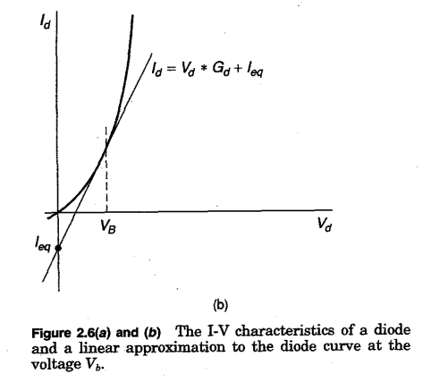
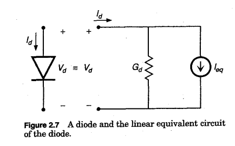
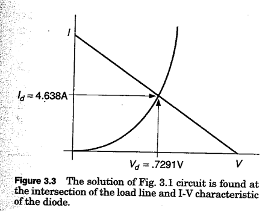
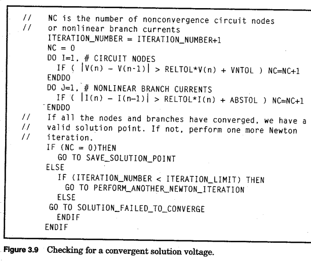
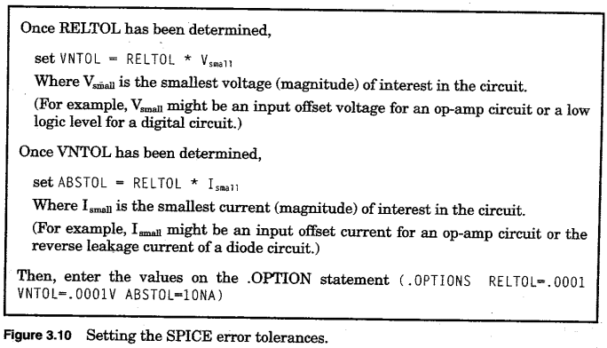
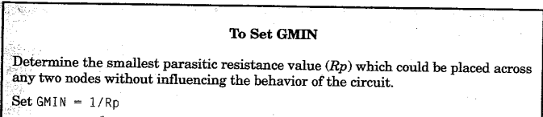
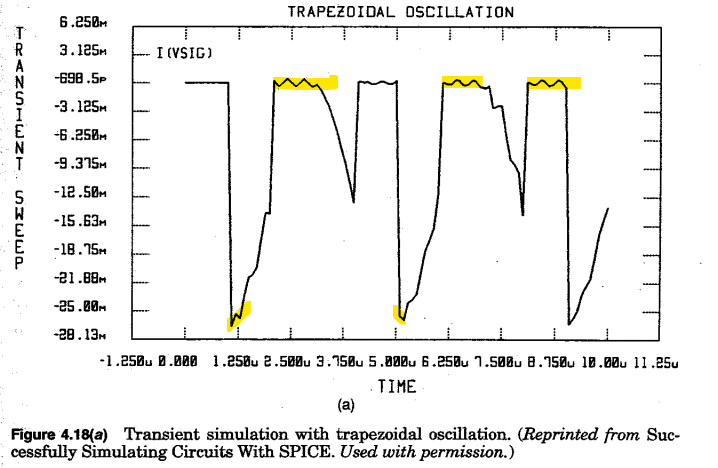

# This is a quick summary of the important parts (to us) from "Inside Spice" by Ron M. Kielkowski
<https://idoc.pub/download/kielkowski-inside-spice-d2nv6ogoxy4k>

## Chapter 2 - Nonlinear Elements
- break into many smaller linear approximations (similar to numerical integration methods for capacitors/inductors)
- linear equivalent model determined by voltage bias of device (conductance of model is equal to slope of straight line approximation at operating point) => We need to change the conductance matrix A during iterations when dealing with nonlinear components (at each solution point, the conductance and current values of the model are computed and stored in the system equations)  
**Linear diode model (p. 22):**  

## Chapter 2 - Nonlinear analysis
- SPICE uses two different solving algorithms (one if only linear components are present and one if both linear and nonlinear components are present)
- Newton-Raphson is used if and only if there are nonlinear components (equations become transcendental)
- Newton-Raphson approach starts with an initial guess for *every node voltage* in the circuit
- Previous solution voltages as initial guess for next series of iterations
- For a Newton-Raphson example applied to a trivial diode circuit, see page 35

## Chapter 3 - Convergence and the Newton-Raphson algorithm
- Newton-Raphson starts with guess and tries to get closer to load line intersection with every successive iteration (see HELM maths link for detailed information)

## Chapter 3 - General Newton-Raphson Convergence Aids
- Includes: RELTOL (default = 0.1%), VNTOL, ABSTOL, setting GMIN (also explained in Mitcheson's lecture slides)
- See page 52 for detailed explanation about what they do and why we need them 

# Chapter 3 - Circuit conductance values
- If the conductance of a nonlinear device becomes zero, Newton-Raphson causes a divide by zero error => program crashes
- Can happen with nonlinear devices (e.g. zero conductance when constant current output)
- **Solution:** Place resistor in parallel with every PN junction (very large resistance => 1000G in SPICE). Also referred to as GMIN
- To avoid Newton-Raphson taking tons of iterations (happens with very small conductance), GMIN should be set as large as possible without affecting the accuracy of the simulation:  

# Chapter 3 - Transient convergence aids (**includes how to start transient analysis**)
- To start transient analysis: Short circuit capacitors and open circuit inductors to determine DC bias point
- Add capacitors/inductors back to the circuit and give them the voltages determined by the DC bias point (no charge up time)

# Chapter 3 - Dynamic timestep control
- Specified "timestep" by user just determines the print-interval for the csv file but not the actual timestep that SPICE uses internally
- SPICE stores its timestep solution points in memory and then uses interpolation to find the desired, evenly-spaced output points
- If there are rapid changes in circuit values between timesteps, SPICE keeps/reduces its timestep to keep accuracy high
- If there are small changes in circuit values between timesteps, SPICE increases its timestep to speed up the simulation
- If SPICE fails to converge at a timepoint, it discards the last timepoint and tries again using 1/8 of the previous timestep

# Chapter 4 - Trapezoidal integration failures
- Not every numerical integration method works for every circuit
- Trapezoidal is default in SPICE and works very well for most circuits
- However, some common signs that Trapezoidal method can produce when it fails (Trapezoidal Oscillation, Accumulated Error):    

# Chapter 5 - Timestep control in the early years *(Problems with constant timestep)*
- Often timestep (set by user) is too large and hence Newton-Raphson fails to converge or companion models for capacitor/inductor become inaccurate
- If timestep is reduced to avoid the problem with a too large timestep, simulations might take ages to complete
- Hence, constant timestep forces the user to choose between a inaccurate simulation or one that takes ages to complete
- => Need a small timestep when we face convergence issues or rapid changes in values and a larger timestep when there are no or tiny changes to the values in the circuit and no convergence issues

# Chapter 5 - An overview of dynamic timestep control
- SPICE computes the first timestep using (transient simulation duration)/50
- 3 things are monitored for deciding if change timestep: 1. Rate of change of circuit voltages/currents 2. Nonconvergence timepoints 3. Source breakpoints

## continue reading p. 131
