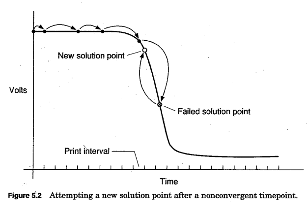
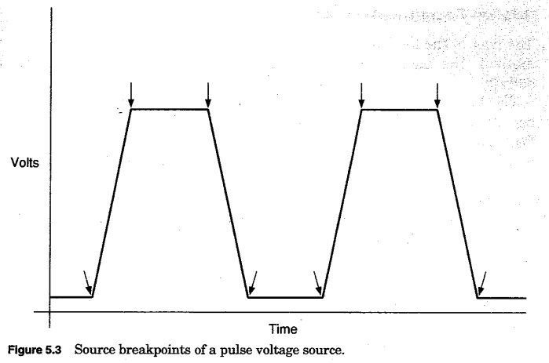
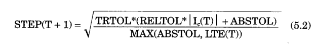
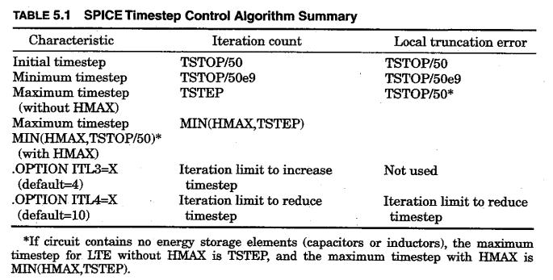

# This is a quick summary of the important parts (to us) from "Inside Spice" by Ron M. Kielkowski
<https://idoc.pub/download/kielkowski-inside-spice-d2nv6ogoxy4k>

## Chapter 2 - Nonlinear Elements
- break into many smaller linear approximations (similar to numerical integration methods for capacitors/inductors)
- linear equivalent model determined by voltage bias of device (conductance of model is equal to slope of straight line approximation at operating point) => We need to change the conductance matrix A during iterations when dealing with nonlinear components (at each solution point, the conductance and current values of the model are computed and stored in the system equations)  
**Linear diode model (p. 22):**  

## Chapter 2 - Nonlinear analysis
- SPICE uses two different solving algorithms (one if only linear components are present and one if both linear and nonlinear components are present)
- Newton-Raphson is used if and only if there are nonlinear components (equations become transcendental)
- Newton-Raphson approach starts with an initial guess for *every node voltage* in the circuit
- Previous solution voltages as initial guess for next series of iterations
- For a Newton-Raphson example applied to a trivial diode circuit, see page 35

## Chapter 3 - Convergence and the Newton-Raphson algorithm
- Newton-Raphson starts with guess and tries to get closer to load line intersection with every successive iteration (see HELM maths link for detailed information)  

## Chapter 3 - General Newton-Raphson Convergence Aids
- Includes: RELTOL (default = 0.1%), VNTOL, ABSTOL, setting GMIN (also explained in Mitcheson's lecture slides)
- See page 52 for detailed explanation about what they do and why we need them 

# Chapter 3 - Circuit conductance values
- If the conductance of a nonlinear device becomes zero, Newton-Raphson causes a divide by zero error => program crashes
- Can happen with nonlinear devices (e.g. zero conductance when constant current output)
- **Solution:** Place resistor in parallel with every PN junction (very large resistance => 1000G in SPICE). Also referred to as GMIN
- To avoid Newton-Raphson taking tons of iterations (happens with very small conductance), GMIN should be set as large as possible without affecting the accuracy of the simulation:  

# Chapter 3 - Transient convergence aids *(includes how to start transient analysis)*
- To start transient analysis: Short circuit capacitors and open circuit inductors to determine DC bias point
- Add capacitors/inductors back to the circuit and give them the voltages determined by the DC bias point (no charge up time)

# Chapter 3 - Dynamic timestep control
- Specified "timestep" by user just determines the print-interval for the csv file but not the actual timestep that SPICE uses internally
- SPICE stores its timestep solution points in memory and then uses interpolation to find the desired, evenly-spaced output points
- If there are rapid changes in circuit values between timesteps, SPICE keeps/reduces its timestep to keep accuracy high
- If there are small changes in circuit values between timesteps, SPICE increases its timestep to speed up the simulation
- If SPICE fails to converge at a timepoint, it discards the last timepoint and tries again using 1/8 of the previous timestep

# Chapter 4 - Trapezoidal integration failures
- Not every numerical integration method works for every circuit
- Trapezoidal is default in SPICE and works very well for most circuits
- However, some common signs that Trapezoidal method can produce when it fails (Trapezoidal Oscillation, Accumulated Error):    

# Chapter 5 - Timestep control in the early years *(Problems with constant timestep)*
- Often timestep (set by user) is too large and hence Newton-Raphson fails to converge or companion models for capacitor/inductor become inaccurate
- If timestep is reduced to avoid the problem with a too large timestep, simulations might take ages to complete
- Hence, constant timestep forces the user to choose between a inaccurate simulation or one that takes ages to complete
- => Need a small timestep when we face convergence issues or rapid changes in values and a larger timestep when there are no or tiny changes to the values in the circuit and no convergence issues

# Chapter 5 - An overview of dynamic timestep control
- SPICE computes the first timestep using (transient simulation duration)/50
- 3 things are monitored for deciding if change timestep: 1. Rate of change of circuit voltages/currents 2. Nonconvergence timepoints 3. Source breakpoints

# Chapter 5 - Timestep control and circuit activity
- Inside Spice mentions 2 different methods to monitor the rate of change of circuit values (comparing the current values to the ones from the last iteration is not mentioned => Maybe this has such a bad performance, that it is not even worth mentioning as a valid method?)
- Rapid changes in circuit values result in Newton-Raphson taking more iterations to converge  
=> The different number of Newton-Raphson iterations required can be used to determine how fast the circuit values are changing and hence if want to increase or decrease the timestep. Also, as decreasing timestep results in fewer Newton-Raphson iterations, we have achieved greater accuracy without significantly increasing the simulation time (Exchanged more Newton-Raphson calculations for more timestep calculations)
- Rapid changes in circuit values lead to a greater error produced by the numerical integration methods
=> Another algorithm to determine timestep control calculates the error produced by the numerical integration methods and uses this to increase or decrease the timestep

# Chapter 5 - Timestep control and nonconvergent timepoints
- Always measure the number of iterations required to converge to a solution timepoint (Newton-Raphson)
- If need to many iteration, we reset to the previous timepoint and try again using (current timestep)/8

- When Spice fails to converge again, the process is repeated
- However, when the timestep ever reaches a minimum timestep, Spice terminates and prints an error message

# Chapter 5 - Timestep control and source breakpoint adjustment 
- Pulse and PWL sources cause *significant accuracy problems* => sharp leading and trailing edges
- To solve the accuracy problem, Spice generates a 'breakpoint table' before the start of the transient simulation (I guess by looking at each Pulse/PWL source, determining the start time + period and then pushing all timepoints at which a rapid transition occurs and that occur before the simulation stop time into some data structure). This table contains beginning and end time of falling/raising edge.
- Spice then forces the timestep control algorithm to solve the circuit at each breakpoint and automatically decreases the timestep after a breakpoint

- *Personal comment:* This is something worth thinking about. It makes sense that this could increase the accuracy by a lot. Won't be too trivial to implement but also doesn't sound too difficult either. Could come directly after we have the normal timestep control algorithm working.

# Chapter 5 - Iterative count timestep control *(first timestep control algorithm)*
- Monitors number of Newton-Raphson iterations at each timepoint that are required for convergence
- When the iterations required become less than a lower threshold, the timestep is doubled (No rapid changes in circuit values)
- When the iterations required become grater than an upper limit, the current timepoint is discarded and the solution is reattempted at the previous timestep using a 1/8 of the origin timestep
- When one of the scenarios keeps happening, the timestep will continue to increase/decrease until the maximum/minimum allowed timestep value is reached
- Maximum timestep = print spacing specified by user
- Minimum timestep = (duration of transient simulation)/50e9
- The simulation terminates when the timestep becomes smaller than the lower limit

# Chapter 5 - Local truncation error timestep control *(second timestep control algorithm)*
- Default method used by Spice (Hence probably better than first method? Also seems more complex)
- Formula is used that predicts the magnitude of the error produced by the numerical integration method (Greater error corresponds to more rapid circuit value changes)
- Amount of error is used to adjust the timestep (Timestep control algorithm aims to keep the error produced by the numerical integration methods within an allowed limit)  

- LTE (formula above) = computed local truncation error estimate
- RELTOL, ABSTOL = convergence error tolerance options from chapter 3 (important to set these correctly based on circuit parameters for this algorithm to work)
- In addition, the maximum number of Newton-Raphson iterations is used (like in last algorithm) to cut the timestep to 1/8 when it is reached
- Minimum allowed timestep = (duration of transient simulation)/50e9
- Maximum allowed timestep = (duration of transient simulation)/50

# Chapter 5 - A comparison of timestep control methods
- Both are good
- Local truncation error algorithm *should* produce more accurate results as it aims to minimize errors produced by the integration method
- The local truncation error algorithm is harder to implement and will only be superior when the values used in the formula are good and the error estimate is accurate => Otherwise the iterative count algorithm will perform better
- *Personal comment:* Based on this, I would suggest going with the iterative count method. It seems decently simple to implement (once we have Newton-Raphson working) and seems accurate enough for our purposes (still better than no timestep control algorithm and sometimes even better than truncation error algorithm)  
